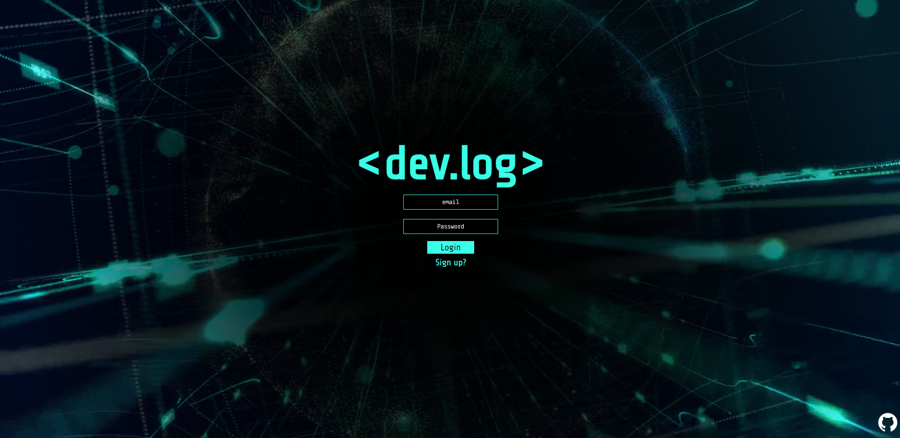

# About Dev-Log
Social media for developers! Connect with other devs and create/explore content for your friends!

Are you a developer? Have you ever thought "I have SO MANY FEELINGS, but NO FRIENDS to vent to!!"? Well you are not alone! With Dev-Log you are now able to connect with other devs on a more personal and light-hearted level.

View deployed app and sign-up at: https://dev-log.herokuapp.com/

 

# Table of Contents
## - [Process](#process)
## - [Features](#features)
## - [Credits](#credits)
## - [License](#license)
## - [Contact](#contact)

 

# Process
Interested in how dev-log came about? Take a look at some of our brainstorming tools!

### Lucid chart, built by Bradley Rodriguez
https://lucid.app/lucidchart/bf210d8f-83ca-42f6-a54b-7260615a61b3/edit?viewport_loc=107%2C248%2C1347%2C647%2C0_0&invitationId=inv_2ca88812-e00a-4a5d-a076-9cbe156f8b24

### Figma, built by Bryan Tempini
https://www.figma.com/proto/3fOcBF0YSzlM5zIRx6lcsK/Work-Section?page-id=0%3A1&node-id=498%3A2&viewport=98%2C735%2C0.19&scaling=min-zoom&starting-point-node-id=444%3A44

 

# Features
### Current
- Create an account with an encrypted password
- Make posts with images that display on global feed and on profile page
- View other user posts on global feed
- Checkout a daily challenge from Code Wars on the feed page
- Update profile picture, username, github, and Dev Level
- Search for other devs and get their contact information

### Coming Soon
- Add friends and view them on your friends list!
- Like posts

 

# Credits
- <a href="https://github.com/JacksonGrimm">**Jackson Grimm**</a> _Lead Developer_
- <a href="https://github.com/Slimshady079">**Max Gibes**</a> _Scrum Master_
- <a href="https://github.com/tessie-the-messy">**Tessa Robinson**</a> _Scrum Master II_
- <a href="https://github.com/HeyItsBradley">**Bradley Rodriguez**</a> _Backend Architect_
- <a href="https://github.com/btempini">**Bryan Tempini**</a> _Frontend Architect_

 

# License: MIT license
Permission is hereby granted, free of charge, to any person obtaining a copy of this software and associated documentation files (the "Software"), to deal in the Software without restriction, including without limitation the rights to use, copy, modify, merge, publish, distribute, sublicense, and/or sell copies of the Software, and to permit persons to whom the Software is furnished to do so, subject to the following conditions:

The above copyright notice and this permission notice shall be included in all copies or substantial portions of the Software.

For more information visit https://opensource.org/licenses/MIT

 

# Contact
To contact individuals, please refer to github links under [credits](#credits).
